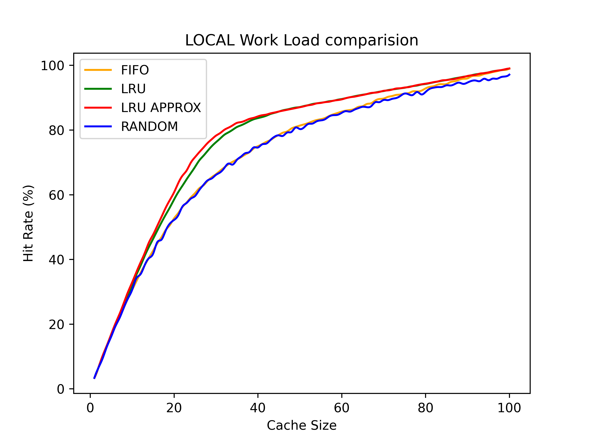
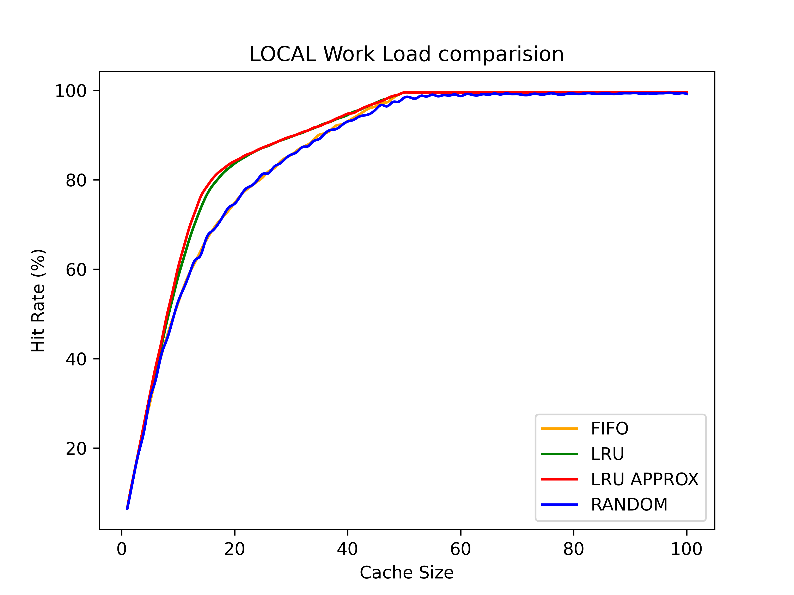
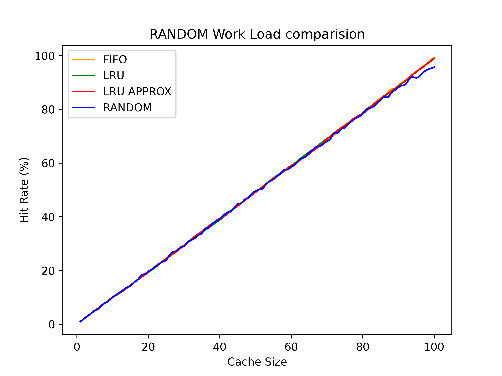
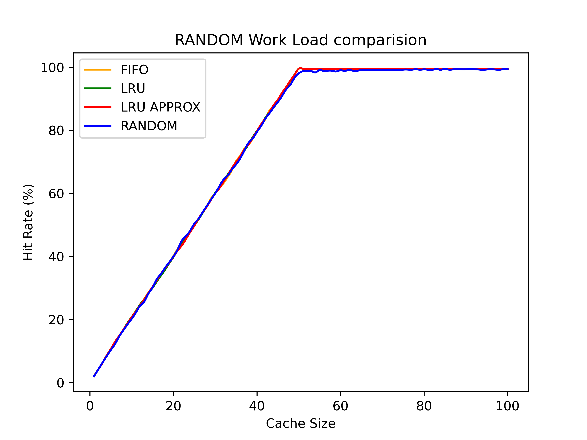
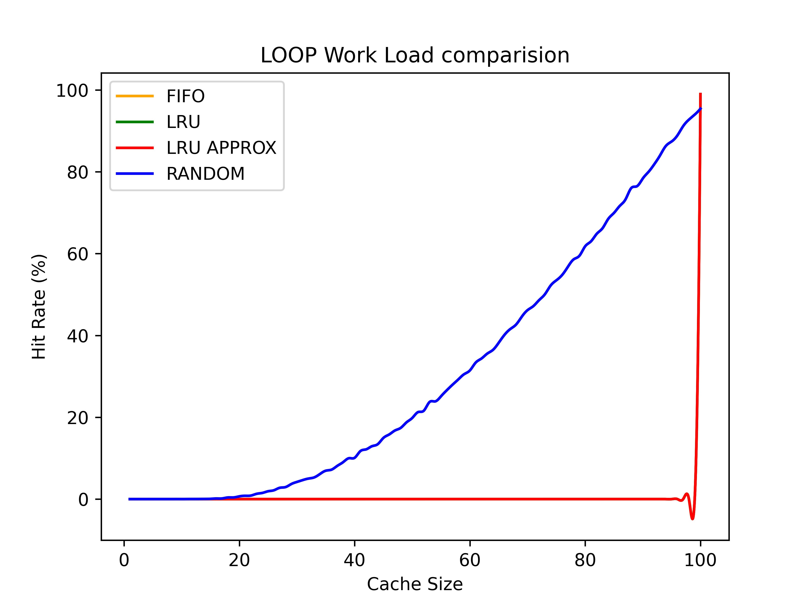
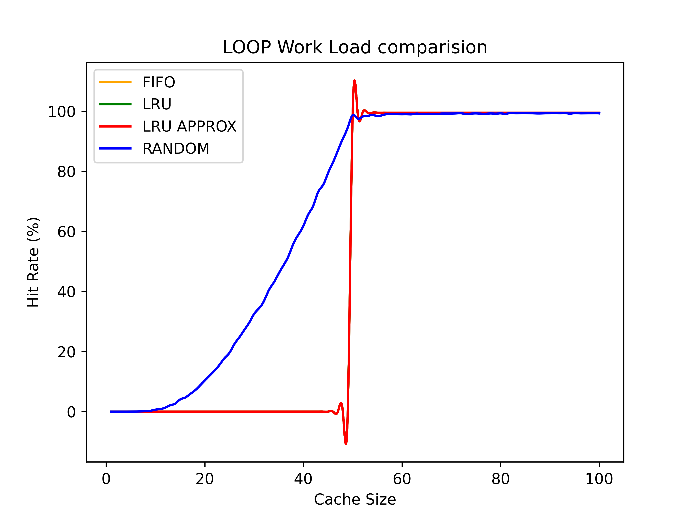

# Caching Policies ⭐

Implementation and comparison of various caching policies/page replacement policies, on different type of workloads in C. 

## Directory Structure 📁

```
Caching-Policies
├─ checker.c
├─ data
│  ├─ LOCAL_FIFO.csv
│  ├─ LOCAL_LRU.csv
│  ├─ LOCAL_LRUAppr.csv
│  ├─ LOCAL_RANDOM.csv
│  ├─ LOOP_FIFO.csv
│  ├─ LOOP_LRU.csv
│  ├─ LOOP_LRUAppr.csv
│  ├─ LOOP_RANDOM.csv
│  ├─ RANDOM_FIFO.csv
│  ├─ RANDOM_LRU.csv
│  ├─ RANDOM_LRUAppr.csv
│  └─ RANDOM_RANDOM.csv
├─ definitions.h
├─ fort.c
├─ fort.h
├─ gen_csv.c
├─ main.c
├─ Makefile
├─ plot.py
├─ plots
│  ├─ type1
│  │  ├─ LOCAL.png
│  │  ├─ LOOP.png
│  │  └─ RANDOM.png
│  └─ type2
│     ├─ LOCAL.png
│     ├─ LOOP.png
│     └─ RANDOM.png
├─ plots.md
├─ policy.c
├─ README.md
└─ workload.c

```
## Feature Checklist ✅
```
✅ Least Recently Used(LRU) caching Policy
✅ Least Recently Used Approx(Clock-Hand) caching Policy
✅ First-In-First-Out(FIFO) caching Policy
✅ Random(FIFO) caching Policy 
✅ In memory workload generation with 80-20 Workload, looping workload, random workload types.
✅ Test script to test the correctness of the policies. 
✅ Benchmarking and comparison of performace of all the caching policies on the 3 type of workloads.
```


## Instructions to Run 🏃

- Run `make build` to build all the files 
- Run `make exec` to execute the files after build
- Run `make plot` to generate the plots for performace comparision
- Run `make check` to run the checker test file
- Run `make clean` to remove the build files 

### Can also run `make all` to execute all commands and generate output. 

## Results and Conclusions 📰


1) ## 80-20

    Cache_Size = 100, Size = 10,000 , Pages = 100            |  Cache_Size = 100, Size = 10,000 , Pages = 50
    :-------------------------:|:-------------------------:
      |  
    
    #
2) ## Random

    Cache_Size = 100, Size = 10,000 , Pages = 100            |  Cache_Size = 100, Size = 10,000 , Pages = 50
    :-------------------------:|:-------------------------:
      |  
    #
2) ## Looping

    Cache_Size = 100, Size = 10,000 , Pages = 100            |  Cache_Size = 100, Size = 10,000 , Pages = 50
    :-------------------------:|:-------------------------:
      |  
    #


##  Time Complexity and Space Complexity Analysis Of Various Scheduling Policies wrt Data Structures 

1) ### FIFO: 
    - Using an array based queue data structure, with space complexity of O(cache_size)
    - A circular pointer representing the head of the queue, for mimicing the pop from FIFQ queue
    - Insert at the ith index & lookup : O(1) Time complexity
    - For every page, takes O(cache_size) time to find it in the queue
    - Total Time complexity: O(size*cache_size)

2) ### LRU:
    - Array based 2d queue one to maintain the page value. The second one is used to maintain the priority. 
    - Space complexity: O(cache_size)
    - Insert at the ith index & lookup : O(1) Time complexity
    - For every page, takes O(cache_size) to find and replace if necessary
    - Overall time complexity: O(size*cache_size)

3) ### LRU Approx: 
    - Array based 2d queue one to maintain the page value. The second one is used to maintain the second chance flag
    - Space complexity: O(cache_size)
    - Insert at the ith index & lookup : O(1) Time complexity
    - For every page, takes O(cache_size) to find and replace if necessary
    - Overall time complexity: O(size*cache_size)
4) ### Random: 
    - Using an array based queue data structure.
    - space complexity of O(cache_size)
    - Insert at the ith index & lookup : O(1) Time complexity
    - For every page, takes O(cache_size) time to find it in the queue
    - Total Time complexity: O(size*cache_size)
